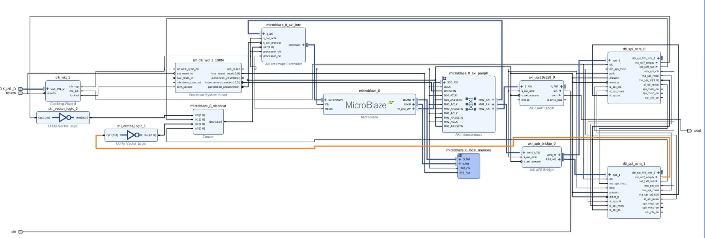
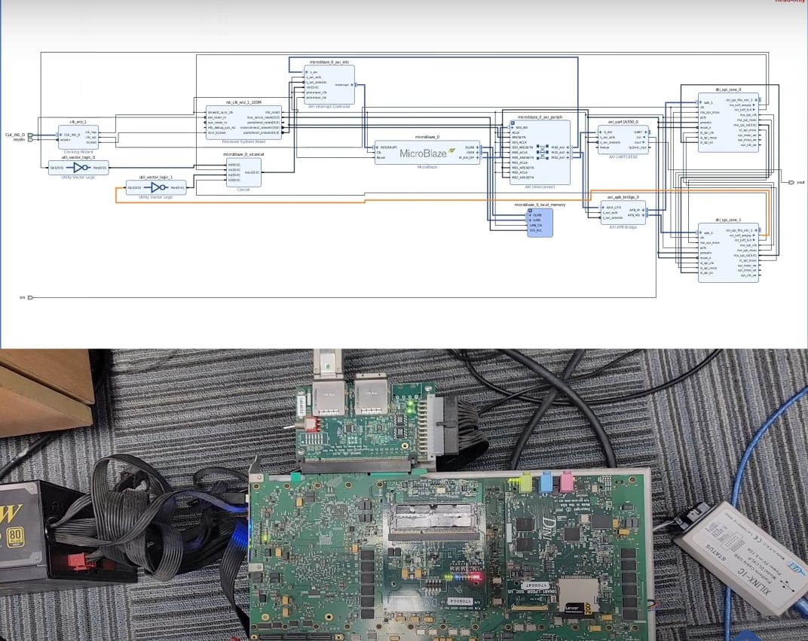

# FPGA_Based_SoC_Design_with_MicroBlaze_and_Custom_SPI_Controller
##  Overview
This project implements a **System-on-Chip (SoC) on FPGA** using the **Xilinx MicroBlaze soft-core processor**.  
The main goal is to design, integrate, and verify a **custom SPI controller (Master/Slave)** with **FIFO buffering and interrupt support**, controlled by MicroBlaze via AXI bus.  

The system was developed in **Vivado** for hardware design and **Xilinx SDK (Vitis)** for software development.  
Testing was carried out on a Xilinx FPGA development board with UART logging for debugging and verification.  

---

##  System Architecture
The SoC consists of the following main components:
- **MicroBlaze CPU** – main processor for controlling peripherals.  
- **AXI Interconnect** – communication backbone between MicroBlaze and IP cores.  
- **BRAM Local Memory** – on-chip memory for code and data.  
- **Custom SPI IP Core** – supports Master/Slave modes, FIFO buffering, and interrupt handling.  
- **UART** – serial interface for debugging and logging.  
- **Interrupt Controller** – manages interrupts from SPI and UART to MicroBlaze.  

Block Design (Vivado IP Integrator):  

---

##  Hardware Setup
- **FPGA Board**: Xilinx Virtex/Kintex development board.  
- **Programmer**: Xilinx JTAG cable for bitstream and software download.  
- **UART connection**: PC ↔ FPGA for logging.  
- **Power Supply**: External PSU.  

Board setup example:  

---

##  Software Implementation
- Development IDE: **Xilinx SDK / Vitis**  
- Language: **C**  
- Functionality:
  - Configure SPI timing, clock, and mode.  
  - Send and receive data using **FIFO + interrupt**.  
  - Display results over UART for verification. 